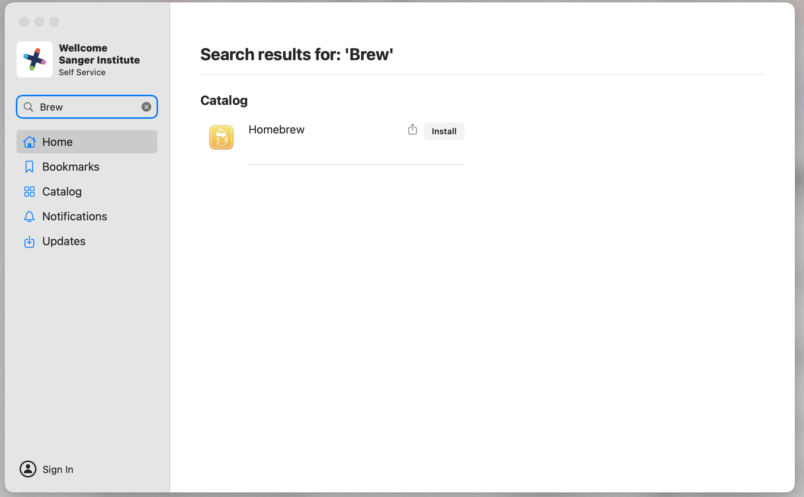
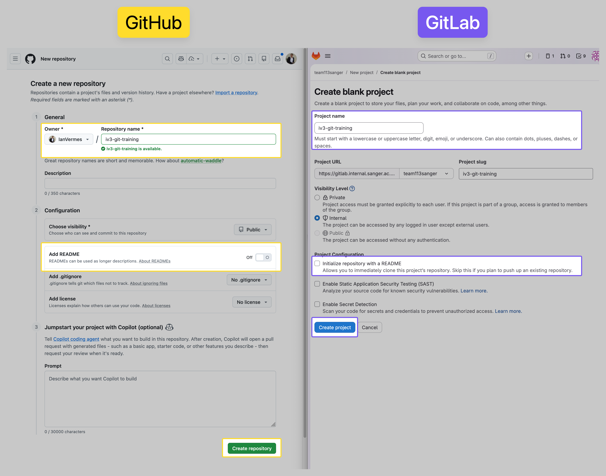

# Git Training Materials


## Steps for Trainer to Check before workshop

1. Does participant have a GitLab account?
2. Has participant been added to the GitLab project? `https://gitlab.internal.sanger.ac.uk/team113_projects/`
3. If using a Sanger Mac is Git installed?


## Git Introduction

### 0. SSH Key Setup (if needed)

Users can copy-paste this code into their terminal to create an SSH keypair if they do not already have one set up.

As a trainer you will need to still explain what SSH keys, show their contents and then demonstrate adding the public key to GitLab.

```bash
# Ensure home directory is not group/other writable (SSH requires this)
chmod go-w "$HOME"
# Create ~/.ssh with safe permissions
mkdir -p "$HOME/.ssh"
chmod 700 "$HOME/.ssh"
# Ensure standard SSH files exist
touch "$HOME/.ssh/config" "$HOME/.ssh/authorized_keys" "$HOME/.ssh/known_hosts"
chmod 600 "$HOME/.ssh/config" "$HOME/.ssh/authorized_keys" "$HOME/.ssh/known_hosts"
# Create RSA keypair if one doesn't already exist
if [ ! -f "$HOME/.ssh/id_rsa" ] && [ ! -f "$HOME/.ssh/id_rsa.pub" ]; then ssh-keygen -t rsa -b 4096 -f "$HOME/.ssh/id_rsa" -N "" -q; else echo "Existing SSH keypair found at ~/.ssh/id_rsa[.pub]; not creating a new one."; fi
# Fix key permissions
[ -f "$HOME/.ssh/id_rsa" ] && chmod 600 "$HOME/.ssh/id_rsa"
[ -f "$HOME/.ssh/id_rsa.pub" ] && chmod 644 "$HOME/.ssh/id_rsa.pub"
```

### 1. Prepare a Synthetic directory for Git Training

We want a directory of realistic analysis/bioinformatics files rather than starting with an empty directory.

```bash
curl -fsSL https://github.com/team113sanger/git-training-materials/releases/latest/download/synthetic_project_files.sh | bash
```

The script will print instructions telling you which directory to `cd` into. It will also check whether Git is installed.

<details>
<summary>Git not installed? (Sanger Mac)</summary>

1. Open the **Self Service** application and search for **Homebrew** — install it.

   

2. Once Homebrew is installed, run in the terminal:
   ```bash
   brew install git
   ```

</details>

### 2. Setting Up Git for the first time
These steps need to be done only once per machine.

```bash
git config --global user.name "Firstname Lastname"
git config --global user.email "<sanger-username>@sanger.ac.uk"
git config --global core.editor "nano" # explain "nano" vs "vim" vs "code --wait"
git config --global init.defaultBranch main
git config --global push.default current
```

<details>
<summary><strong>What do these settings do?</strong></summary>

- We want `user.name` and `user.email` to best facilitate collaboration and attribution of one's work, particularly important in scientific authorship.
- We want `core.editor` set to a terminal editor that lets us easily write commit messages.
- We want `init.defaultBranch main` so that new repositories start with a `main` branch as per GitHub/GitLab convention, rather than the old default of `master`.
- We want `push.default current` so that `git push` will push the current branch to a branch of the same name on the remote, without needing to specify `git push origin <branch-name>` every time. This is a good default for new Git users, for simple remotes and plays well with `Hubflow`-style branching too.

</details>


### 3. Create a new repository on GitHub/GitLab

Guide trainees through creating a new project. The trainer will specify whether to use GitHub or GitLab and instruct them to use the **SSH URI** for all steps.

Here we are simulating a situation where work has already been done on the filesystem and we want to put it under version control. A more common approach is to start with a brand new Git repo and add files to it over time.

<details>
<summary><em>Screenshot: creating an uninitialised repo</em></summary>



</details>

<details open>
<summary><strong>If the repo was created empty (no initialisation)</strong></summary>

```bash
git init
git remote add origin <YOUR_SSH_URI>
```

</details>

<details>
<summary><strong>If the repo was initialised (with README.md, .gitignore, or LICENSE)</strong></summary>

```bash
git init
git remote add origin <YOUR_SSH_URI>
git pull origin main
```

This pulls the remote's initial commit, bringing in its files alongside your project files. All project files remain untracked and ready for `git add`.

</details>

### 4. The Git Loop
We familiarise ourselves with the basic Git workflow: `git add`, `git commit` and `git push` punctuated by `git status` to check our progress.

```bash
# Like adding a single item to your shopping cart
git add <file>
# or git add <file> <file> <file>
# or git add <directory>
# or git add .

# Like reviewing your cart and changes before you pay
git status

# Like confirming your order in checkout with a short note about what you're buying
git commit -m "Your message here"

# Like sending your confirmed order to the store to be processed
git push
```

## Importantant talking points

1. When to use Git in one's work
2. The difference between local and remote repositories
3. What is a commit and why commit messages matter
4. Discuss perfection - no such thing as perfect code; do not wait to commit before submitting to a journal. Use analogy of Manuscript DOCX with regards to versioning and how long before saving.